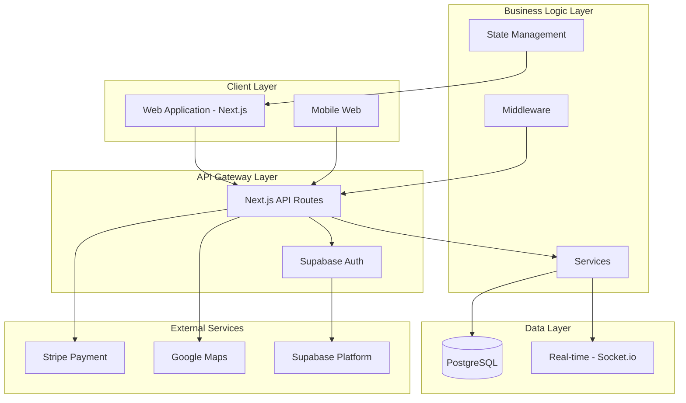
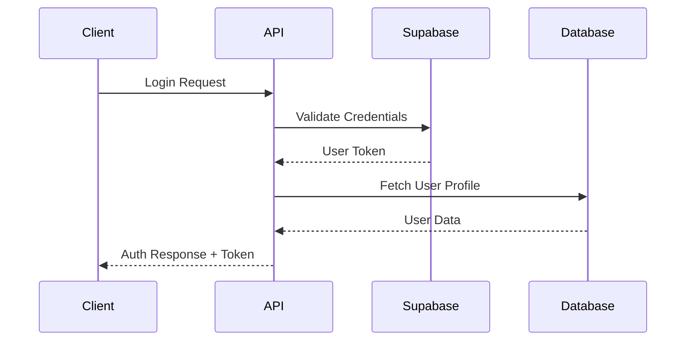
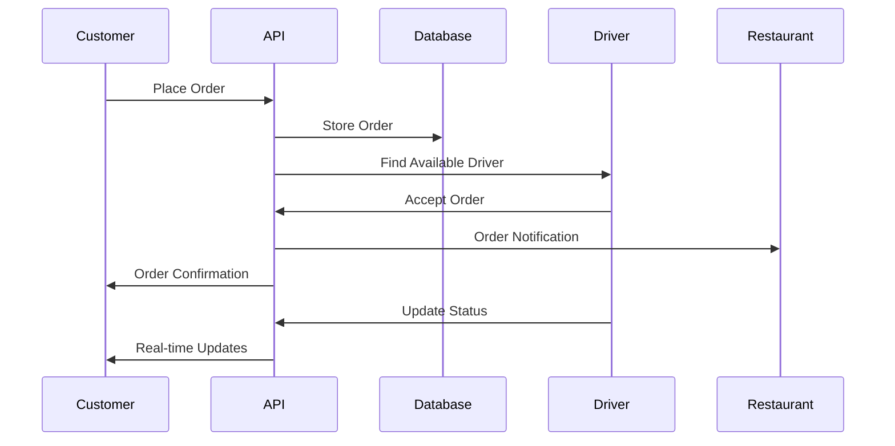

# System Architecture

## Overview

The food delivery platform is built using modern web technologies with a microservices-inspired architecture. The system follows a multi-tier architecture with clear separation of concerns between presentation, business logic, and data layers.

## Architecture Diagram

## Technology Stack

### Frontend
- **Next.js 15**: React-based web framework with App Router
- **React 19**: User interface library
- **TypeScript**: Type-safe JavaScript
- **Tailwind CSS**: Utility-first CSS framework
- **Zustand**: Lightweight state management

### Backend
- **Next.js API Routes**: Server-side API endpoints
- **Prisma ORM**: Database toolkit and query builder
- **Supabase**: Backend-as-a-Service platform

### Database
- **PostgreSQL**: Primary relational database
- **Prisma**: Database ORM with type safety

### Authentication & Authorization
- **Supabase Auth**: Authentication service
- **JWT Tokens**: Session management
- **Role-based Access**: Multi-role system (Customer, Driver, Vendor, Admin)

### Real-time Features
- **Socket.io**: WebSocket communication
- **Google Maps API**: Location services

### External Integrations
- **Stripe**: Payment processing
- **Google Maps**: Location and mapping services
- **Supabase**: Cloud database and auth

## System Architecture Principles

### 1. Separation of Concerns
- **Presentation Layer**: React components and pages
- **Business Logic Layer**: Services and utilities
- **Data Layer**: Database models and API routes
- **Authentication Layer**: Supabase integration

### 2. Scalability
- Horizontal scaling through stateless API design
- Database optimization with proper indexing
- Caching strategies for frequently accessed data
- Real-time updates without blocking operations

### 3. Security
- JWT-based authentication
- Role-based authorization
- Input validation and sanitization
- Secure API endpoints
- HTTPS enforcement

### 4. Performance
- Server-side rendering with Next.js
- Image optimization
- Code splitting and lazy loading
- Database query optimization

## Core Components

### Authentication Flow

### Order Processing Flow

## Database Architecture

### Key Entities
- **Users**: Multi-role user management
- **Restaurants**: Vendor-owned establishments
- **Orders**: Order lifecycle management
- **Drivers**: Delivery personnel
- **Addresses**: User location data

### Relationships
- Users can have multiple roles (Customer + Driver)
- Restaurants belong to vendors
- Orders link customers, restaurants, and drivers
- Real-time location tracking for drivers

## API Architecture

### RESTful Design
- Consistent URL patterns
- HTTP method semantics
- JSON request/response format
- Proper status codes

### Authentication Strategy
- Bearer token authentication
- Token refresh mechanism
- Role-based endpoint access

## State Management

### Client State
- **Zustand Stores**: Authentication, Cart, Orders, Locations
- **Persistent Storage**: Local storage for cart and preferences
- **Real-time Updates**: WebSocket integration

### Server State
- **Database State**: PostgreSQL with Prisma
- **Session State**: Supabase sessions
- **Cache Layer**: In-memory caching where appropriate

## Security Architecture

### Authentication
- Supabase Auth integration
- JWT token management
- Session persistence

### Authorization
- Role-based access control
- Route-level protection
- API endpoint security

### Data Protection
- Input validation
- SQL injection prevention
- XSS protection
- CSRF protection

## Performance Optimizations

### Frontend
- Next.js static generation where possible
- Image optimization with Next.js Image
- Code splitting and dynamic imports
- Lazy loading of components

### Backend
- Database query optimization
- Connection pooling
- Caching strategies
- API response compression

### Database
- Proper indexing strategy
- Query optimization
- Connection management
- Transaction handling

## Deployment Architecture

### Development Environment
- Local PostgreSQL with Docker
- Environment variable management
- Hot reload for development

### Production Environment
- Vercel deployment for Next.js
- Supabase cloud database
- CDN for static assets
- Environment-specific configurations

## Monitoring and Observability

### Logging
- API route logging
- Error tracking
- Performance monitoring

### Analytics
- User behavior tracking
- Order metrics
- Performance metrics

## Future Architecture Considerations

### Microservices Migration
- Service separation strategy
- API gateway implementation
- Event-driven architecture

### Scalability Enhancements
- Horizontal scaling
- Load balancing
- Database sharding
- Caching layers

---

*Last updated: October 2025*