# User Flow Documentation

## Overview

This document provides detailed user flow diagrams for all user roles in the food delivery platform. Each flow illustrates the step-by-step journey users take to accomplish their goals within the system.

## Customer Flow

### Customer Registration and Onboarding

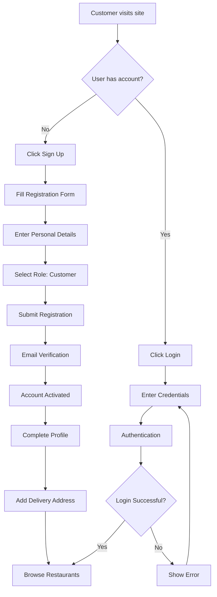

### Customer Order Process

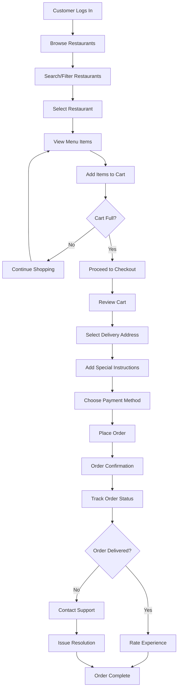

### Customer Order Tracking Flow

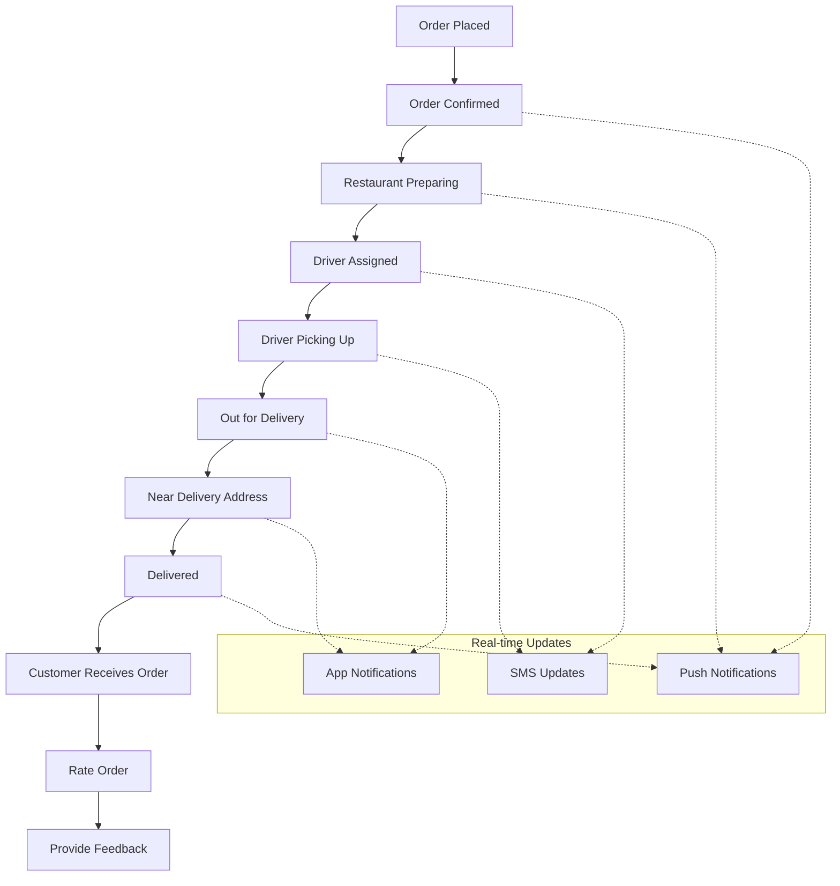

## Driver Flow

### Driver Registration and Approval

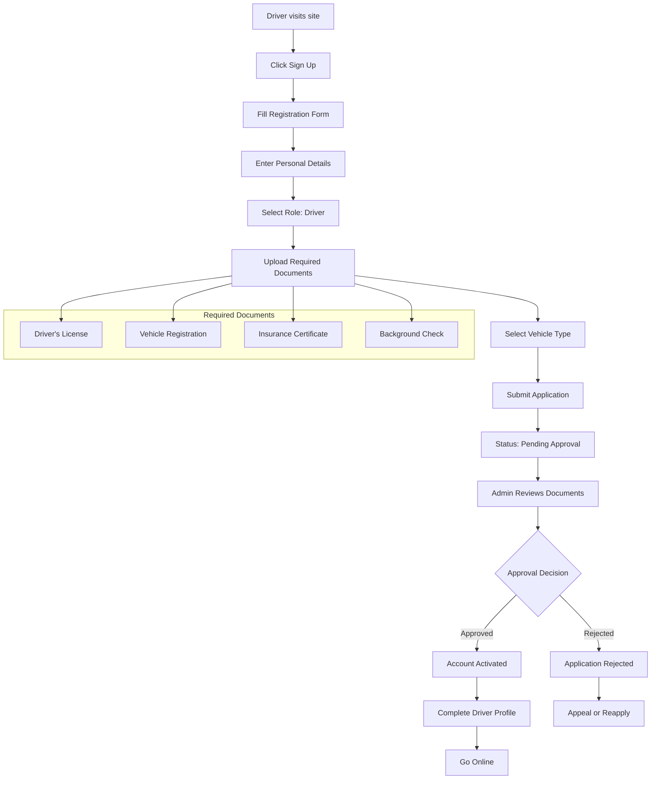

### Driver Daily Operations

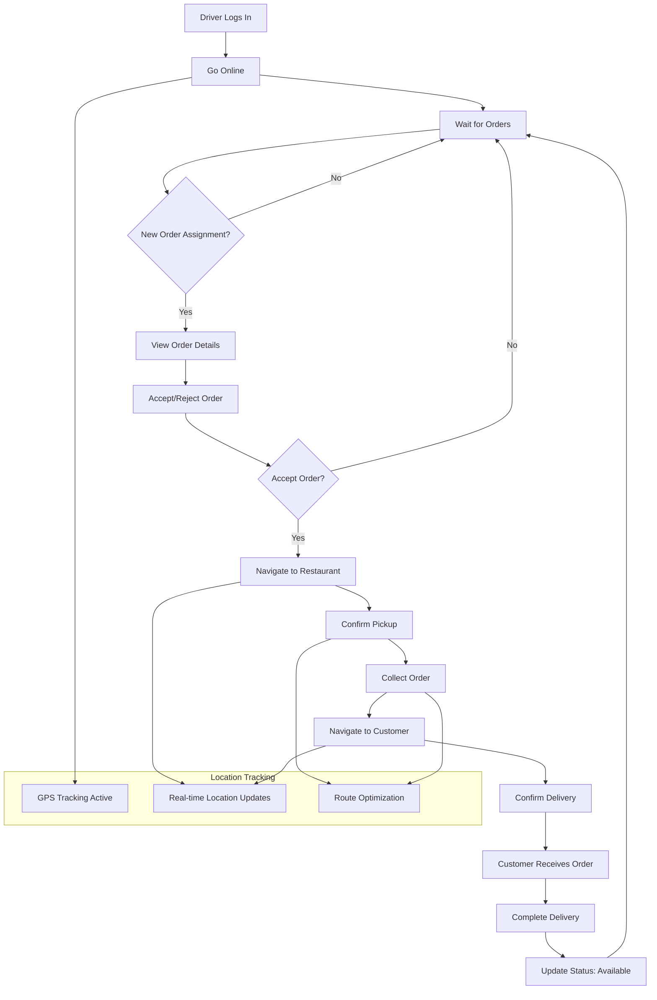

### Driver Order Management

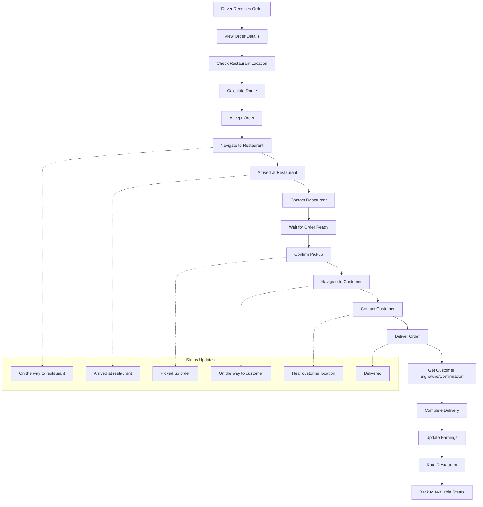

## Vendor Flow

### Vendor Registration and Setup

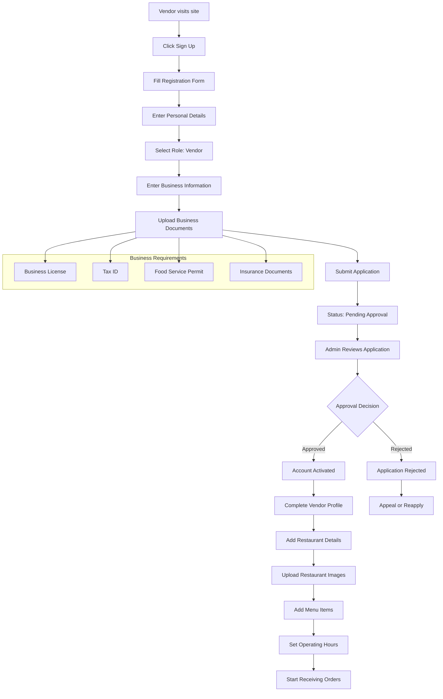

### Vendor Order Management

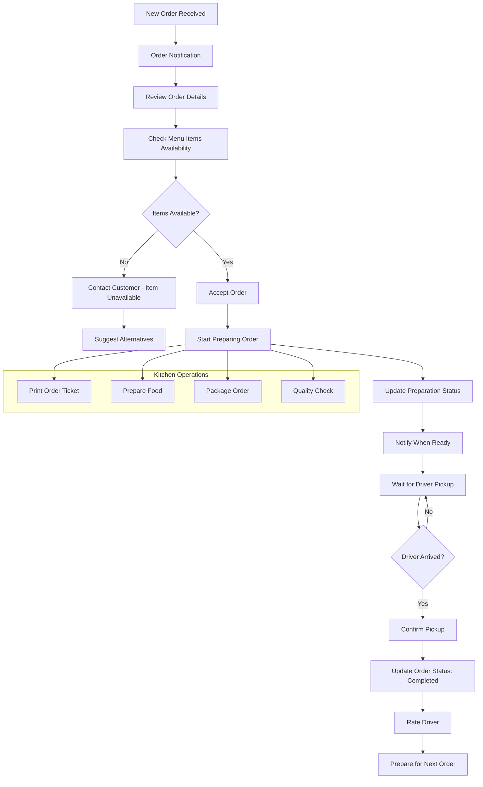

### Vendor Menu Management

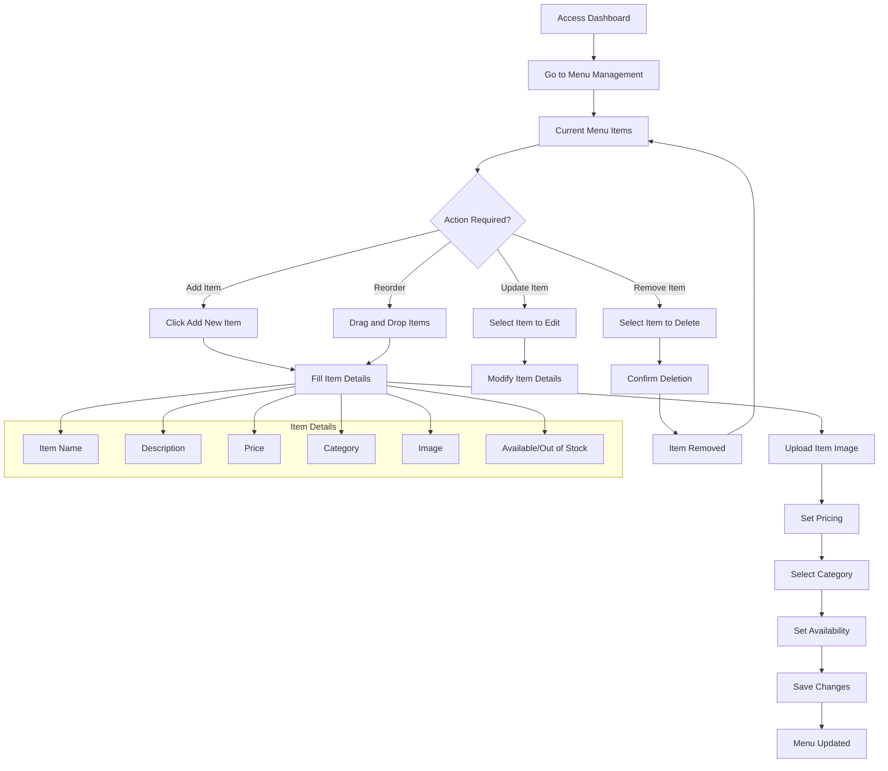

## Admin Flow

### Admin System Management

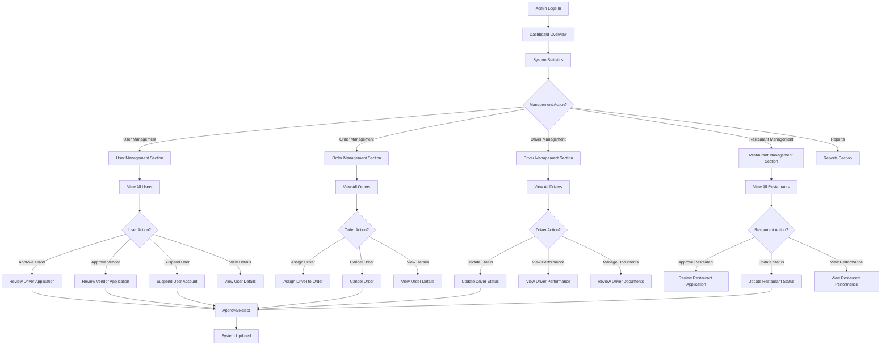

### Admin User Approval Process

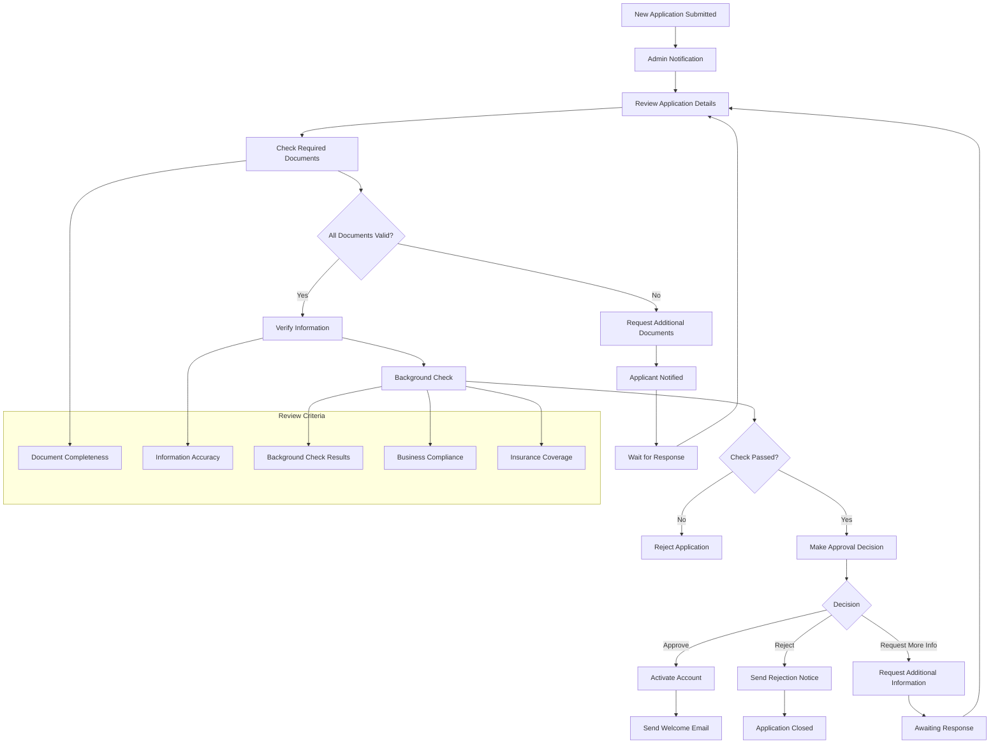

## Cross-Role Interactions

### Order Lifecycle Across Roles

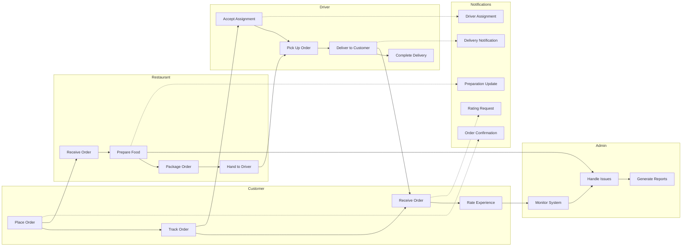

### Real-time Communication Flow

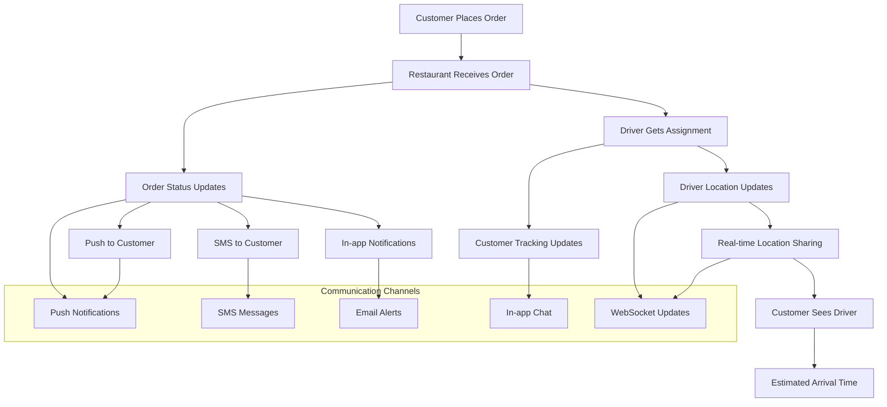

## Mobile User Flows

### Mobile App Navigation

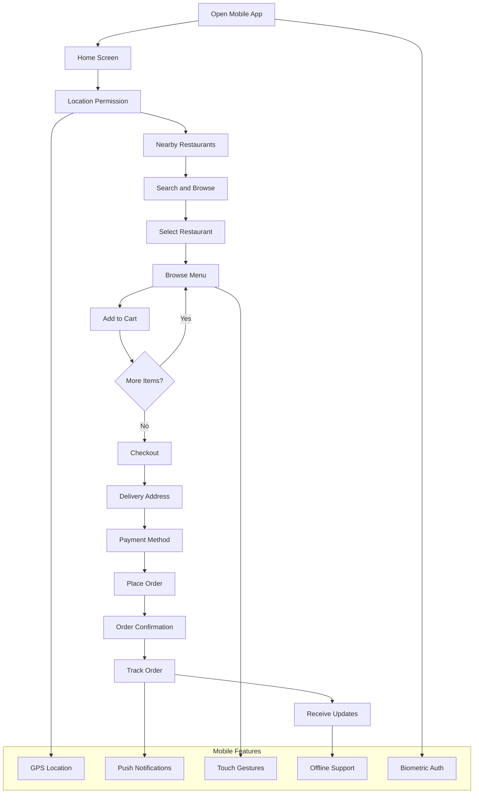

---

*Last updated: October 2025*